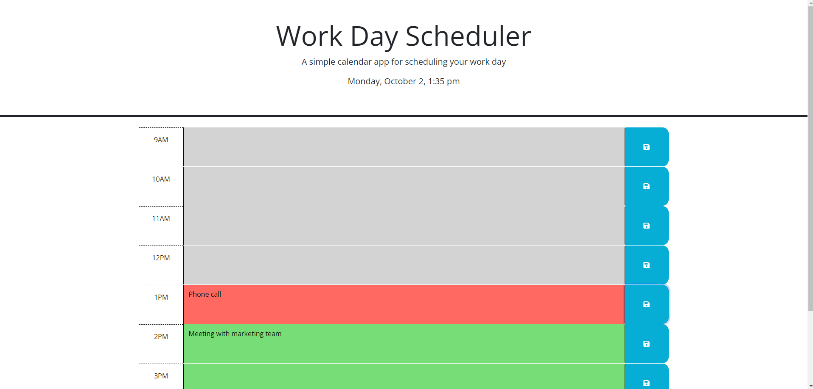

# daily-planner

## Link 

https://ajdancer.github.io/daily-planner/

## Screenshot

## Description

The purpose of this web application is to save events on a daily planner.
Time-blocks will display previously saved events, color coded based on current time of day.
New events may be added given that the time-block has not already passed or begun.
Current day will be displayed at the top of the calendar.

## How to use

A green background represent a time-block where an event can be added. Click in the block to type the event desired. Click the save icon to save the event. Future events can be removed by deleting the event and re-saving the time-block.